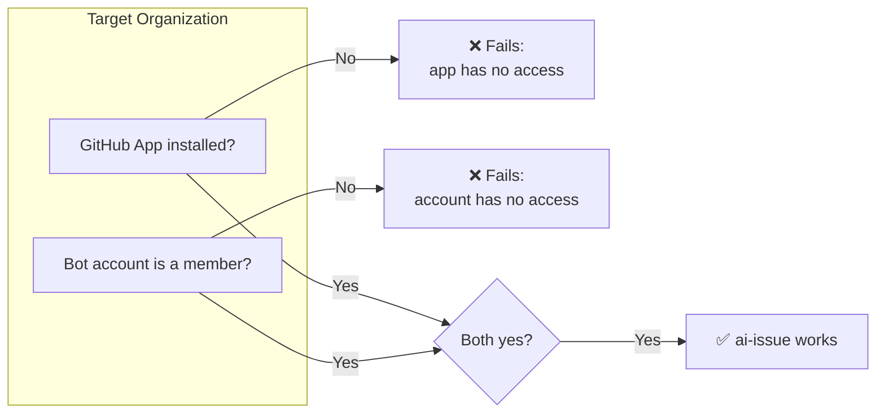

# AI Issue Publisher

[](https://github.com/replworks/ai-issue/actions/workflows/ci.yml)
[](https://github.com/replworks/ai-issue/actions/workflows/release.yml)
[](https://github.com/replworks/ai-issue/actions/workflows/update-changelog.yml)
[](https://pkg.go.dev/github.com/replworks/ai-issue)
[](https://github.com/replworks/ai-issue)


> Stop losing good AI ideas in chat history.
>
> Turn AI conversations into GitHub Issues with one command.

AI Issue Publisher converts AI-generated markdown from ChatGPT, Claude, Cursor, and other assistants into GitHub Issues.

The AI writes the idea. Humans decide whether it becomes work.

---

## Installation

### Homebrew (Recommended)

```bash
brew install replworks/tap/ai-issue
```

### Go

```bash
go install github.com/replworks/ai-issue/cmd/ai-issue@latest
```

Verify installation:

```bash
ai-issue diagnose
```

---

## Configuration

### Why not just a Personal Access Token?

A PAT is the obvious first choice, and it works — until you need to publish to more than one organization.

A PAT is tied to a specific authorization for the account that created it.
Using it across multiple organizations means separately authorizing (or getting admin approval for) that PAT in each one, and re-doing that dance every time you add a new org. It works for a single repo or a single org, but it doesn't scale past that.

AI Issue Publisher instead authenticates as a **GitHub App via device flow**. Concretely, this means:

- You log in **once**, as a dedicated account (default `ai-backlog-bot`, or your own via `AI_ISSUE_PUBLISHER`).
- To add a new organization, you install the app there and add that same account as a member — no new token, no per-org PAT approval.
- Every issue is created under that one consistent, recognizable identity, across every org you've set up.

The trade-off: setup has two moving parts (the app installation, and the account's org membership) instead of one PAT. In exchange, adding a new org is a five-minute checklist instead of a new credential to manage.

### 1. Log in

```bash
ai-issue login
```

The command will:

- open the GitHub device login page
- show you an 8-digit code to enter
- save the resulting token locally after authorization

The token is stored at `os.UserConfigDir()/ai-issue/token`:

| OS      | Path                                           |
| ------- | ---------------------------------------------- |
| macOS   | `~/Library/Application Support/ai-issue/token` |
| Linux   | `~/.config/ai-issue/token`                     |
| Windows | `%AppData%\ai-issue\token`                     |

By default, issues are created as `@ai-backlog-bot`. To use a different account (e.g. one shared across your organizations), set:

```bash
export AI_ISSUE_PUBLISHER=replworks-bot
```

and log in as that account when prompted by the device flow.

### 2. Adding a new organization



Because the tool uses a **user-to-server** token (not an app-only installation token), publishing to a new org requires two separate things — missing either one will cause it to fail:

1. **Install the GitHub App** on the target repository or organization:
   https://github.com/apps/ai-issue/installations/new

2. **Make sure the publishing account is a member of that organization**,
   with write access to the target repo. This is the account from step 1 above (default `ai-backlog-bot`, or your `AI_ISSUE_PUBLISHER` override).
   Installing the app alone is not enough — the app acts _as this account_, so the account needs its own access to the org, same as any other member.

3. If the organization enforces SSO or requires separate app approval,
   complete that authorization, then re-run:

```bash
   ai-issue login
```

See [Troubleshooting](#troubleshooting) if you hit `Resource not accessible by app token` after these steps.

---

## Usage

Copy AI-generated markdown to your clipboard and run:

```bash
ai-issue
```

Preview only:

```bash
ai-issue --dry-run
```

Diagnostics:

```bash
ai-issue diagnose
```

---

## Example

### AI Output

```markdown
# Add timestamps to logging system

Current logs do not contain timestamps, making debugging difficult.

Acceptance Criteria

- Include UTC timestamps
- Preserve current log format
- Add tests
```

### Publish

```bash
ai-issue
```

### Result

```text
✅ Issue created successfully!
https://github.com/owner/repository/issues/42
```

---

## Core Philosophy

### Author ≠ Publisher

AI Issue Publisher is built around a simple principle:

- AI authors the content.
- Humans review the content.
- Humans decide whether to publish it.

Publishing is always an explicit human decision.

### Dedicated AI Identity

Issues are created under a dedicated AI identity rather than your personal
account, so AI-generated issues are immediately identifiable while
preserving human accountability for what actually gets published. See
[Configuration](#configuration) for how this identity is set and how to add
it to a new organization.

---

## Troubleshooting

### GitHub App token is required

```bash
ai-issue login
```

### Repository could not be determined

Run the command inside a Git repository.

### Clipboard is empty

Copy AI-generated markdown before running the command.

### Resource not accessible by app token

This almost always means one of the two setup steps in [Adding a new organization](#2-adding-a-new-organization) was missed.
Verify:

- The GitHub App is installed on the target repository or organization
- The publishing account (`ai-backlog-bot` or your `AI_ISSUE_PUBLISHER` override) is a member of that organization with write access
- `Issues: Read and write` permission is granted to the app
- You completed `ai-issue login` after installing the app
- Organization approval or SSO authorization is complete, if required

### Need more details?

```bash
ai-issue diagnose
```

---

## Development

Run tests:

```bash
go test ./...
```

Build:

```bash
make build
```

Release:

```bash
goreleaser release --clean
```

---

## License

MIT

---

Built for developers who use AI every day and want good ideas to reach the backlog.
