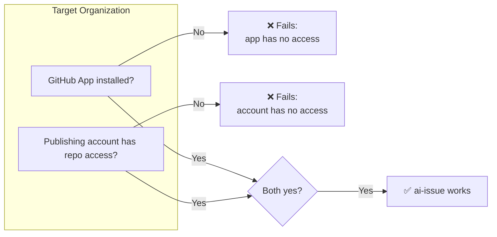

# AI Issue Publisher

[](https://github.com/replworks/ai-issue/actions/workflows/ci.yml)
[](https://github.com/replworks/ai-issue/actions/workflows/release.yml)
[](https://github.com/replworks/ai-issue/actions/workflows/update-changelog.yml)
[](https://pkg.go.dev/github.com/replworks/ai-issue)
[](https://github.com/replworks/ai-issue)


> Stop losing good AI ideas in chat history.
>
> Turn AI conversations into GitHub Issues with one command.

AI Issue Publisher converts AI-generated markdown from ChatGPT, Claude, Cursor, and other assistants into GitHub Issues.

The AI writes the idea. Humans decide whether it becomes work.

---

## Installation

### Homebrew (Recommended)

```bash
brew install replworks/tap/ai-issue
```

### Go

```bash
go install github.com/replworks/ai-issue/cmd/ai-issue@latest
```

Verify installation:

```bash
ai-issue diagnose
```

### Linux requirements

Linux builds are provided for `amd64` and `arm64`. The publish command reads
the clipboard, so a desktop Linux environment must provide one of these
clipboard utilities:

- X11: `xclip` or `xsel`
- Wayland: `wl-clipboard` (`wl-copy` and `wl-paste`)

`xdg-open` is used to open the GitHub device-login page automatically. If it is
not available, the URL is still printed and can be opened manually.

---

## Configuration

### Why not just a Personal Access Token?

A PAT is the obvious first choice, and it works — until you need to publish to more than one organization.

A PAT is tied to a specific authorization for the account that created it.
Using it across multiple organizations means separately authorizing (or getting admin approval for) that PAT in each one, and re-doing that dance every time you add a new org. It works for a single repo or a single org, but it doesn't scale past that.

AI Issue Publisher instead authenticates with a **GitHub App user access token via device flow**. The token represents the GitHub account that authorizes the app, and GitHub attributes API activity to that account and the app.

- You log in once with the GitHub account you want to use for publishing.
- To add a new organization, install the app there and give that same account access — no new token or per-organization PAT approval is required.
- The GitHub account remains the Issue author; `ai-issue` also records the configured publisher identity in the Issue body.

The trade-off: setup has two moving parts (the app installation and the account's access) instead of one PAT. In exchange, adding a new organization is a short checklist instead of a new credential to manage.

### One-time setup

1. **Choose the GitHub account that will authorize publishing.**
   This can be your normal GitHub account. A separate bot account is optional,
   not required. The account used during device flow authorization is the
   account GitHub records as the Issue author.

   The publisher label included in the Issue body defaults to `ai-backlog-bot`.
   To customize that label, set:

```bash
   export AI_ISSUE_PUBLISHER=your-bot-account
```

2. **Log in with that account.**

```bash
   ai-issue login
```

This will:

- open the GitHub device login page
- show you an 8-digit code to enter
- save the resulting token locally after you authorize the app

The token is stored at `os.UserConfigDir()/ai-issue/token`:

| OS      | Path                                           |
| ------- | ---------------------------------------------- |
| macOS   | `~/Library/Application Support/ai-issue/token` |
| Linux   | `~/.config/ai-issue/token`                     |
| Windows | `%AppData%\ai-issue\token`                     |

### Per-organization setup

Repeat both steps for **every** organization or repository you want to publish to — missing either one will cause it to fail:

1. **Install the GitHub App:**
   https://github.com/apps/ai-issue/installations/new

   You can install it on all repositories or select specific ones.

2. **Give the publishing account write access.** The account used during one-time setup needs its own access to the target repo — the app user token acts _on behalf of this account_, so installing the app alone is not enough.
   Either:
   - add it as an organization member with write access, or
   - add it as an outside collaborator on the specific repo

   If the organization enforces SSO, also authorize the account for SSO access; if app installation requires admin approval, complete that too.

Why both are required:



See [Troubleshooting](#troubleshooting) if you hit `Resource not accessible by app token` after completing these steps.

---

## Usage

Copy AI-generated markdown to your clipboard and run:

```bash
ai-issue
```

Preview only:

```bash
ai-issue --dry-run
```

Diagnostics:

```bash
ai-issue diagnose
```

---

## Example

### AI Output

```markdown
# Add timestamps to logging system

Current logs do not contain timestamps, making debugging difficult.

Acceptance Criteria

- Include UTC timestamps
- Preserve current log format
- Add tests
```

### Publish

```bash
ai-issue
```

### Result

```text
✅ Issue created successfully!
https://github.com/owner/repository/issues/42
```

---

## Core Philosophy

### Author ≠ Publisher

AI Issue Publisher is built around a simple principle:

- AI authors the content.
- Humans review the content.
- Humans decide whether to publish it.

Publishing is always an explicit human decision.

### Publisher identity

The GitHub account authorized through device flow is the actual Issue author. The
configured publisher identity, which defaults to `ai-backlog-bot`, is metadata
written into the Issue body so the publishing decision remains traceable.
It does not change the GitHub author account.
See [Configuration](#configuration) for how this label is configured.

---

## Troubleshooting

### GitHub App token is required

```bash
ai-issue login
```

### Repository could not be determined

Run the command inside a Git repository.

### Clipboard is empty

Copy AI-generated markdown before running the command.

### Resource not accessible by app token

This almost always means one of the two steps in
[Per-organization setup](#per-organization-setup) was missed. Verify:

- The GitHub App is installed on the target repository or organization
- The publishing account is a member (or outside collaborator) of that repository/organization with write access
- `Issues: Read and write` permission is granted to the app
- You completed `ai-issue login` after installing the app
- Organization approval or SSO authorization is complete, if required

### Need more details?

```bash
ai-issue diagnose
```

---

## Development

Run tests:

```bash
go test ./...
```

Build:

```bash
make build
```

Release:

```bash
goreleaser release --clean
```

---

## License

MIT

---

Built for developers who use AI every day and want good ideas to reach the backlog.
